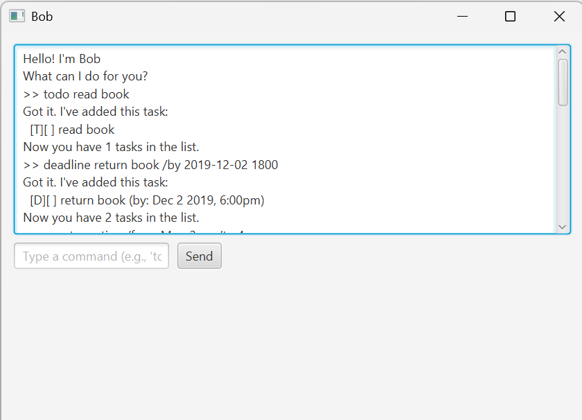

# Duke — User Guide

> Duke is a simple chatbot that helps you manage tasks such as Todos, Deadlines, and Events from the command line.



---

## Quick Start

1. Ensure you have **Java 11 or above** installed.  
   Check with:
   ```bash
   java -version

